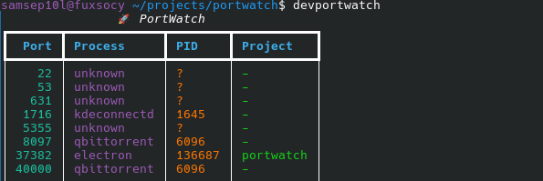

# 🚀 PortWatch

> Real-time developer port monitoring tool for Linux.

PortWatch helps developers quickly inspect, filter, and manage running ports and development processes directly from the terminal.

Instead of juggling `ss`, `lsof`, `grep`, and `kill`, PortWatch gives you a clean live dashboard with process and project awareness.

---


# 📸 Demo



---

# 📦 Installation

## Install from PyPI

```bash
pip install devportwatch
```

---

# ▶️ Usage

## Show all active ports

```bash
devportwatch
```

---

## Live monitoring dashboard

```bash
devportwatch live
```

---

## Filter by process

```bash
devportwatch node
```

```bash
devportwatch python
```


---

## Kill process running on a port

```bash
devportwatch kill 3000
```

---


# ⚙️ Requirements

- Linux
- Python 3.10+
- `ss` command available (`iproute2`)

Install on Arch Linux:

```bash
sudo pacman -S iproute2
```


# 🤝 Contributing

Pull requests are welcome.

If you find a bug or have a feature idea, open an issue.

---

# 📄 License

MIT License

---


